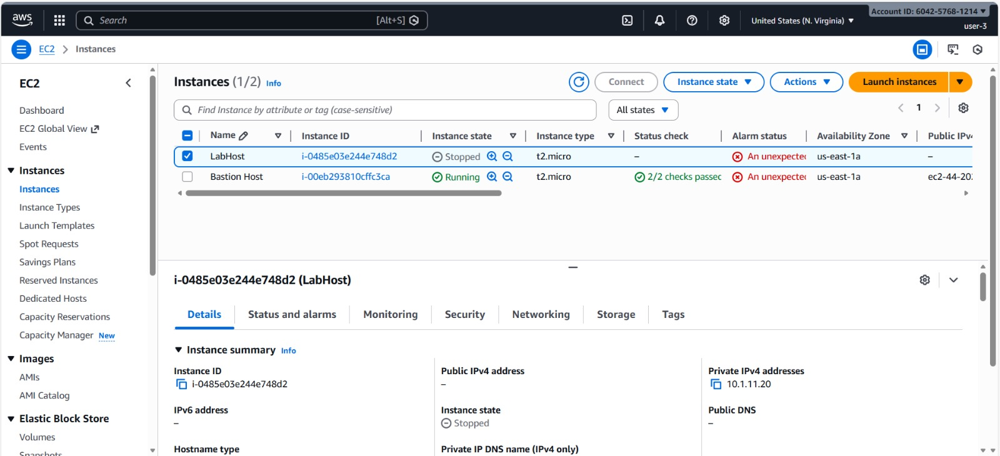

# Lab 1 - Introduction to AWS Identity and Access Management (IAM)

## Title
Introduction to AWS Identity and Access Management (IAM)

## Objective
The objective of this lab is to understand how AWS Identity and Access Management (IAM) controls authentication and authorization in AWS. The lab focuses on exploring IAM users and groups, analyzing attached policies, assigning users to appropriate groups based on organizational roles, and validating permissions by testing service access.

## Prerequisites
- Basic understanding of cloud computing concepts  
- AWS Academy Lab access  
- Web browser with internet connectivity  

## Tools Used
- AWS Management Console  
- AWS Identity and Access Management (IAM)  
- Amazon EC2  
- Amazon S3  

## Tasks Performed

### Task 1: Explore IAM Users and Groups
- Reviewed pre-created IAM users: user-1, user-2, user-3  
- Explored IAM groups: EC2-Admin, EC2-Support, S3-Support  
- Inspected managed and inline policies attached to groups  
**Screenshot:**  

### Task 2: Add Users to Groups
- Added user-1 to the S3-Support group  
- Added user-2 to the EC2-Support group  
- Added user-3 to the EC2-Admin group  
**Screenshot:**  

### Task 3: Test IAM User Permissions
- Logged in using IAM sign-in URL  
- Verified S3 access for user-1  
- Verified EC2 read-only access for user-2  
- Verified EC2 administrative access for user-3  
**Screenshot:**  

## Workflow
1. Accessed IAM console and reviewed users and groups.  
2. Inspected policy permissions attached to groups.  
3. Assigned users to groups based on their roles.  
4. Logged in as each IAM user using the sign-in URL.  
5. Validated permissions by accessing AWS services.  

## Learning Outcomes
- Understood the role of IAM in AWS security.  
- Learned how IAM users, groups, and policies interact.  
- Gained practical experience implementing role-based access control.  
- Verified permission enforcement through real-time service testing.  

## Conclusion
This lab provided hands-on experience with AWS IAM by demonstrating how organizations manage secure access to cloud resources. Assigning users to groups with predefined policies simplified permission management and ensured role-based access control across AWS services.

## Author
**Name:** Your Name and (Reg No)
**Course:** Introduction to Cloud Computing  

